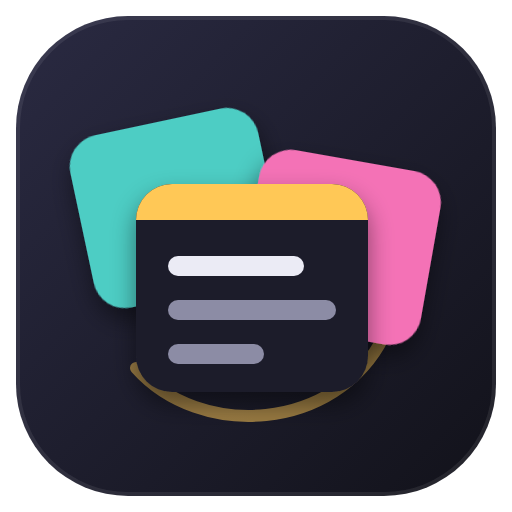
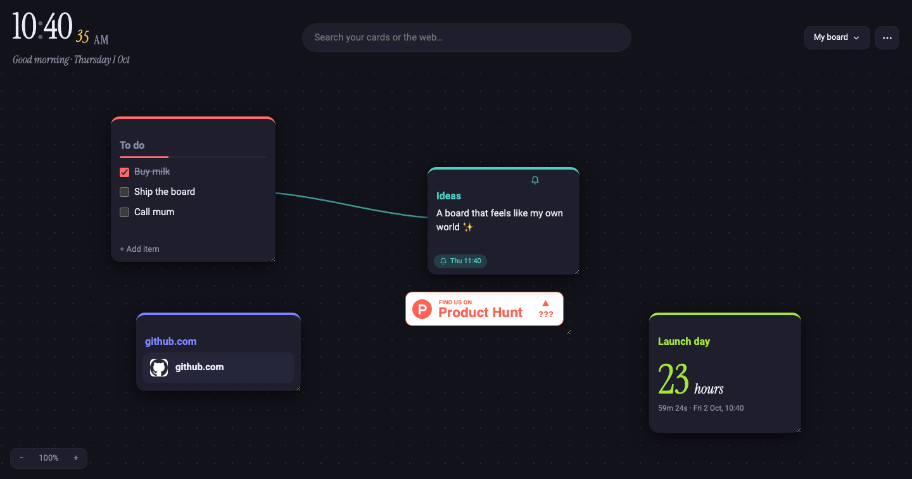

<p align="center"></p>

<h1 align="center">Board</h1>

<p align="center">Your own world on every new tab — a Chrome new tab page where everything is a card you can drag around.</p>



## Features

- **Infinite canvas** — drag empty space to move around, pinch or ⌘/Ctrl + scroll to zoom, press **C** to see everything
- **Card types** — notes, checklists, links (with site icons), images, countdowns, and embeds/badges (paste a Product Hunt badge or any image link)
- **Connect cards** with lines, like a detective board
- **Reminders** on any card — a desktop notification fires even with no tab open
- **Pin** cards in place, recolor them, resize from the corner, delete with undo
- **Search** across all your cards from the top bar (Enter with nothing selected searches the web)
- **Multiple boards** — switch with the board menu or keys **1–9**
- **Backgrounds** — dots, grid, plain, or your own wallpaper
- **Sync** text across computers through your Chrome account; backups to a file
- **Drop or paste** images, links and text straight onto the board
- A rolling serif clock, and a matching dark Chrome theme

Everything saves automatically to your browser. Nothing is sent anywhere except Chrome sync (if you leave it on).

## Install

1. Download or clone this repo
2. Open `chrome://extensions` and turn on **Developer mode**
3. Click **Load unpacked** and choose the `newtab` folder
4. Optional: **Load unpacked** again and choose the `theme` folder for the matching browser theme
5. Open a new tab and click **Keep it** when Chrome asks

## Shortcuts

| Key | Action |
| --- | --- |
| Double-click board | Add a card |
| `N` | New note |
| `C` | Show all cards |
| `/` | Search |
| `0` / `+` / `-` | Reset / zoom in / zoom out |
| `1`–`9` | Switch boards |
| `Esc` | Close menus, cancel connecting |

## Project layout

```
newtab/                 the extension
  newtab.html           page shell
  background.js         service worker: reminder notifications
  css/                  base, topbar, board, cards, ui
  js/
    main.js             entry point
    state.js            state, migration, saving
    board.js            cards: build, drag, resize, add, delete
    cards/              one file per card type + index.js registry
    links.js            connections between cards
    view.js             pan, zoom, background
    input.js            mouse, keyboard, paste, drop
    menus.js            board switcher, ⋯ menu, add menu, backups
    search.js           card search
    sync.js             cross-tab and Chrome account sync
    reminders.js        reminder popover + alarms
    clock.js, ui.js, dom.js, icons.js, images.js
theme/                  matching dark Chrome theme
design/                 icon source
```

**Adding a card type:** create `newtab/js/cards/yourtype.js` exporting `{ label, size, defaults, build, text }` and register it in `cards/index.js`.

No build step, no dependencies — plain HTML, CSS and ES modules.

## License

MIT
